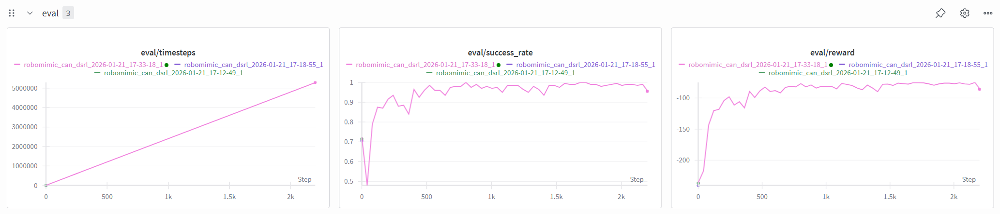
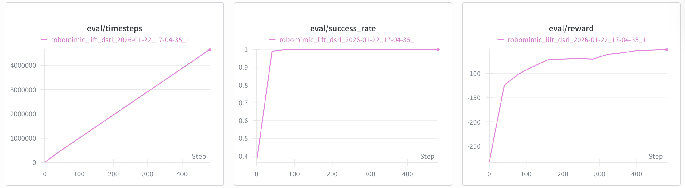
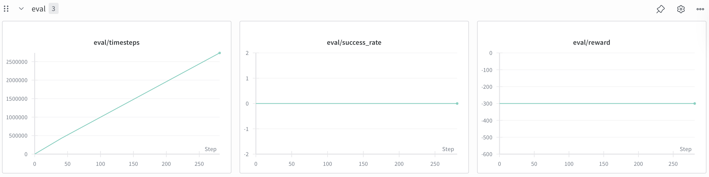
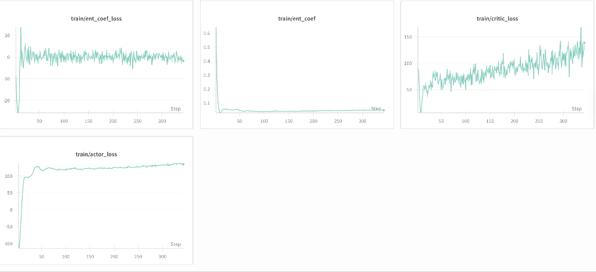
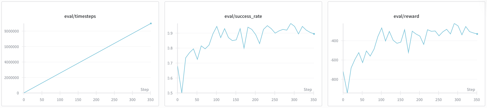

# VLA-R3L Research Log

## [2026-01-18] Topic Development
- After talking with mentor, determined my research topic: VLA-R3L.
- Decide to use diffusion policy (DPPO) as action trunk generator and design reflective RL to optimize the accuracy.
- Paper Reading
	- Steering Your Diffusion Policy with Latent Space Reinforcement Learning
		- Designed based on the diffusion model and to handle the behavior clone (BC) problem
            1. Use Latent-Noise Space
            2. Noise Aliasing
	- Diffusion Policy Policy Optimization
		Optimize the PPO method to fine-tune the diffusion policy
	- Reinforcement Learning with Action Chunking
		Design based on the Q-learning method, instead of accessing each action of joints, pay attention to the action trunk and adjusting TD based algorithm to make unbiased n-step backups more stable
        
## [2026-01-19] Environment Setup & Code Deconstruction
- Successfully connect cloud server
- DSRL dependencies 
  - conda env python 3.9 :white_check_mark:
  - dppo :white_check_mark:
  - robomimic :x:
  - gym :x:
The reason why these two environment fail is that they all relies on MuJoCo. I encountered development problem.
```bash
Successfully built dppo robosuite
Failed to build mujoco
ERROR: ERROR: Failed to build installable wheels for some pyproject.toml based projects (mujoco)
```
The set up instruction in git requires 
```bash
pip install -e ".[robomimic]"
pip install -e ".[gym]"
```
they will try to develop mujoco automatically, but they use mujoco_py at 2021, this will lead to mujoco, there are conflicts between mujoco_py and mujoco, causing error.

Bug status: [solved] :white_check_mark:
I tried to add the mujoco210 into environment path, and jump the mujoco dvelop in -e" ".
- run `dsrl_can.yaml` inference.
- outcome: 
```bash
wandb: Currently logged in as: wenkai001 (wenkai001-nanyang-technological-university-singapore). Use `wandb login --relogin` to force relogin
wandb: wandb version 0.24.0 is available!  To upgrade, please run:
wandb:  $ pip install wandb --upgrade
wandb: Tracking run with wandb version 0.17.7
wandb: Run data is saved locally in /home/wenkai001/ssd/ziming/dsrl/wandb/run-20260119_234516-l9c9r8jx
wandb: Run `wandb offline` to turn off syncing.
wandb: Syncing run robomimic_can_dsrl_2026-01-19_23-45-15_1
wandb: ⭐️ View project at https://wandb.ai/wenkai001-nanyang-technological-university-singapore/dsrl
wandb: 🚀 View run at https://wandb.ai/wenkai001-nanyang-technological-university-singapore/dsrl/runs/l9c9r8jx
[2026-01-19 23:45:20,372][root][INFO] - Number of network parameters: 575564
Error executing job with overrides: []
Error in call to target 'model.diffusion.diffusion_eval.DiffusionEval':
FileNotFoundError(2, 'No such file or directory')
full_key: model

Set the environment variable HYDRA_FULL_ERROR=1 for a complete stack trace.
wandb: 🚀 View run robomimic_can_dsrl_2026-01-19_23-45-15_1 at: https://wandb.ai/wenkai001-nanyang-technological-university-singapore/dsrl/runs/l9c9r8jx
wandb: ⭐️ View project at: https://wandb.ai/wenkai001-nanyang-technological-university-singapore/dsrl
wandb: Synced 6 W&B file(s), 0 media file(s), 0 artifact file(s) and 1 other file(s)
wandb: Find logs at: ./wandb/run-20260119_234516-l9c9r8jx/logs
wandb: WARNING The new W&B backend becomes opt-out in version 0.18.0; try it out with `wandb.require("core")`! See https://wandb.me/wandb-core for more information.
```
basiclly set up accessable environment, but need hfm5 demo video to train.

## [2026-01-20] Environment test & Meeting

- Meet with prof Ziwei and report my progress and schedule
- test one shallow video, tried to run, but failed due to the path error. Tries to include correct path into origin yaml file.

## [2026-01-21] RL with can task Run Successfully & Learning

- Debugging
  1. Firstly, I added the video into dataset, but there still returns error of ```FileNotFoundError```. Checking the the instruction note in DSRL github web, I found that I forgot to add the pretrained diffusion weight parameters into corresponding position (```cfg/robomimic-pretrain/can/can_pre_diffusion_mlp_ta4_td20/2024-06-28_13-29-54/checkpoint/state_5000.pt```). Only included npz and pt files correctly, the first check of program runs.
  2. Adding files, the yaml runs, but still had error. It still related to the mujoco edition problem. So I tried to make a fake mujoco which could let the program to find mujoco_py stead of mujoco. Because if program didn't find mujoco, pip would be called to re-download instead of using mujoco_py. However, I failed since there are plenty of port different between new and old edition. Finally, I reloaded the conda env and installed the mujoco-3.2.2. After doing this, the DSRL runs successfully. :fireworks:
- Learning
  After searching on the webset, I decide to use the book "EasyRL" to fulfill my basic knowledge about RL.

## [2026-01-22] Get Performance of can Task

- After about 20h running, the model had evoluted 132M epoch. The performance:

Key Evaluation Metric:
  - reward: -86.0
  - success_rate: 0.955
- Implement the zshrc file to add wandb account switch configuation.
  ```bash
  choose_wandb_account() {
  case "${WANDB_ACCOUNT:-}" in
    wenkai) export WANDB_API_KEY="22cebf0bb161d48464c99389b6228820abbfbb1e"; echo "WANDB: wenkai"; return;;
    jiarui) export WANDB_API_KEY="0957abdb0d515ff4cbfb603ecb02f5501bba1c39"; echo "WANDB: jiarui"; return;;
    haoyuan) export WANDB_API_KEY="0957abdb0d515ff4cbfb603ecb02f5501bba1c39"; echo "WANDB: haoyuan"; return;;
    jingyi) export WANDB_API_KEY="b7d0464a10ce268a89c509fcac73a89e153cf6c4"; echo "WANDB: jingyi"; return;;
    yukun) export WANDB_API_KEY="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"; echo "WANDB: yukun"; return;;
  esac
  if is_interactive; then
    echo "请选择 wandb 账户:"
    echo "1) wenkai"
    echo "2) jiarui"
    echo "3) haoyuan"
    echo "4) jingyi"
    echo "5) yukun"
    read -p "输入序号: " choice
    case "$choice" in
      1) export WANDB_API_KEY="22cebf0bb161d48464c99389b6228820abbfbb1e"; echo "WANDB: wenkai" ;;
      2) export WANDB_API_KEY="0957abdb0d515ff4cbfb603ecb02f5501bba1c39"; echo "WANDB: jiarui" ;;
      3) export WANDB_API_KEY="0957abdb0d515ff4cbfb603ecb02f5501bba1c39"; echo "WANDB: haoyuan" ;;
      4) export WANDB_API_KEY="b7d0464a10ce268a89c509fcac73a89e153cf6c4"; echo "WANDB: jingyi" ;;
      5) export WANDB_API_KEY="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"; echo "WANDB: yukun" ;;
      *) export WANDB_API_KEY="22cebf0bb161d48464c99389b6228820abbfbb1e"; echo "WANDB: default=wenkai" ;;
    esac
  else
    export WANDB_API_KEY="22cebf0bb161d48464c99389b6228820abbfbb1e"
  fi
  }
  is_interactive && choose_wandb_account
  export OPENBLAS_NUM_THREADS=1
  export OMP_NUM_THREADS=1 

## [2026-01-23] Finish lift Task & Begin square Task
- The outcome of lift task:
  
  The lift task is the easiest task among four test tasks, its convergence speed is most fast as shown in above figure.
- Running the square task, due to its complexity, the training time will be. uch longer than lift.

## [2026-01-24] Encounter Problem for square Task
- After training for about 28h, the success_rate still keeps 0, even no fluctuation, as shown in the following graph.
  
  After analyzing and reviewing the paper, I get the rough conclusion:
  The model didn't wrong, because the loss line is changing, the model have tried to teach how to do square task correctly.
   All in all, I get 2 possibilities:
  1. As paper mentioned, square task is too complex compared with lift and can, so they added the ```train_offline.npz```, 32000 steps trained data to decrease the time needed, The missing of data may lead to low success rate.
  2. The given ```env.max_episode_steps``` is 300, which is appropriate, but may cause this situation: when the grip went to correct position and want to put the object down, the max step reached, which will be considered as the failure. Actually, it may succeed if we allowed it to continue. 
  After checking, the $1^{st}$ is passed, I do added the npz file. Therefore, I need to check 2 senario. The adding of max step is to limit the robotic arm in real world, avoiding the danger (out of joint range). But in simulation, we could set it longer. Therefore, I changed it to 1600. Though,the time consumed for each step is much longer, I just need to run several steps to compare with origin to figure out whether it affect or not.
  I need to wait until tomorrow.
- While the reproduction encountered difficulties, I need to wait for result for next step, I learn the MDP and read code instead.  

## [2026-01-26] Comparition & Analyze

With 2 days running, there comes a good new that my assumption is right.

According to recent 20 steps, the evaluation rate has increased from around 0.8 to around 0.9, the lowest success rate is 0.5, which proves that the max step do effect and limit the success possibilities. Its initial success rate is over 0 as while (0.5), which proves the useness of train_offline data. 

| Category | Metric            | Value    |
|----------|-------------------|----------|
| rollout  | ep_len_mean       | 400      |
| rollout  | ep_rew_mean       | -290     |
| time     | episodes          | 1796     |
| time     | fps               | 3        |
| time     | time_elapsed      | 186271   |
| time     | total_timesteps   | 723200   |
| train    | actor_loss        | -2.29e+03|
| train    | critic_loss       | 1.63e+05 |
| train    | ent_coef          | 1.65     |
| train    | ent_coef_loss     | -0.104   |
| train    | learning_rate     | 0.0003   |
| train    | n_updates         | 903980   |
| train    | noise_critic_loss | 1.98e+05 |

Above is the log of most recent training. Due to the complexity of square task and limitation of GPU, the fps is low, which requires more time to get acceptable success rate performance.

## [2026-01-27] Convergence of square Task
Though, the success rate of square task didn't become stable, its rate has increased intensively compared with yesterday. In addiition, the trend of success line is apperantly going up. In my opinion, the square task roughly succeed.


## [2026-01-30] Idea of Next Step
With the suggestion of mentor Wenkai, I want to combine the dsrl property with a vla model. Because the paper only analyze the bility of dsrl getting appropriate action trucnk with reduced computation ability with latent action space method. What I want to do is adding similar method to vla models to increase their performance.
The procedure I roughly designed:

1. Choose appropriate vla model ($\pi 0$, GROOT ...) 
2. Run the vla model with simulation, robomimic to get baseline
3. Add the dsrl method to vla (maybe convert from diffusion to flow matching)
4. If succeed, compare to analyze the effect.
5. Transmit to real world. 